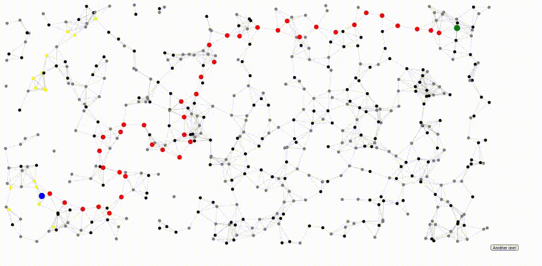

# A\* Algorithm

This program is a simple implementation of A\* algorithm, only for learning purposes.

The only problem is paths' cost (cost of the reaching from one node/state to another using an action). I just randomly choosen some nodes to be higher cost nodes, meaning that paths to them have more cost. Other path costs are choosen randomly.

Heuristic function is simply **Euclidean Distance** between a node and the goal.

For better understanding of the algorithm or for comparing it with Dijkstra, try to change below constants in the code and then reload to see changes:

- OBSTACLE_NODE_GSCORE_CONST: It will get multiplied into randomly choosen path cost.
- OBSTACLE_NODE_PROB:
- HEURISTIC_CONST: It will get multiplied into result of heuristic function. If you decrease this value, the algorithm be more like **Dijkstra** algorithm.
- MIN_EDGE_GSCORE: Lower bound of the randomly choosen edge cost.
- MAX_EDGE_GSCORE: Upper bound of the randomly choosen edge cost.
- NUM_OF_NODES: Number of nodes in the generated graph. Increase it if you want to have a more dense graph or reverse.
- NODES_NEIGHBORS_RADIUS: A value which nodes within this radius will be neighbors of each node.

